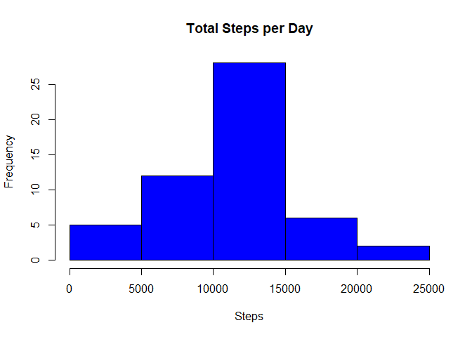
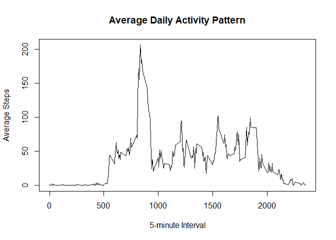
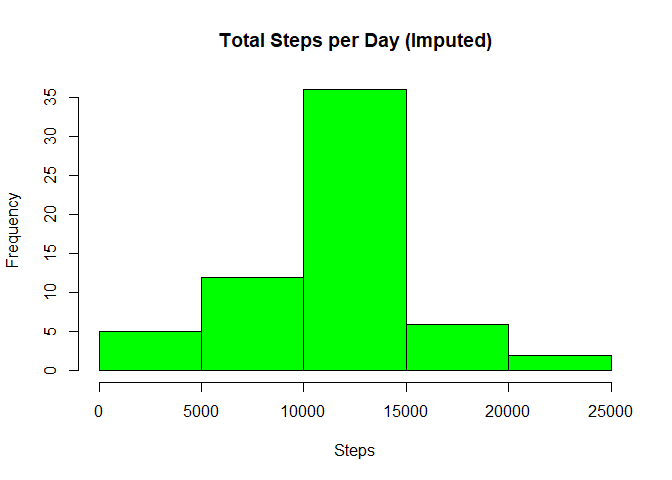
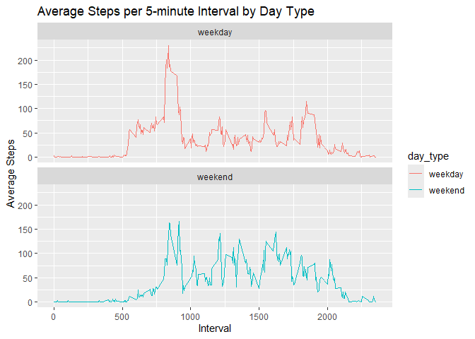

# Introduction
This report analyzes activity data collected from a personal activity monitoring device, examining daily step patterns and investigating missing data patterns.


# Loading and Preprocessing the Data

``` r
# Load the data
data <- read.csv("activity.csv")

# Convert date column to Date type
data$date <- as.Date(data$date)
```

# What is the Mean Total Number of Steps Taken per Day?

``` r
# Calculate total steps per day, ignoring missing values
total_steps_per_day <- data %>%
  filter(!is.na(steps)) %>%
  group_by(date) %>%
  summarize(total_steps = sum(steps))

# Plot histogram of total steps per day
hist(total_steps_per_day$total_steps, main = "Total Steps per Day", xlab = "Steps", col = "blue")
```

<!-- -->

``` r
# Calculate mean and median total steps per day
mean_steps <- mean(total_steps_per_day$total_steps)
median_steps <- median(total_steps_per_day$total_steps)
mean_steps
```

```
## [1] 10766.19
```

``` r
median_steps
```

```
## [1] 10765
```

# What is the Average Daily Activity Pattern?

``` r
# Calculate average steps for each 5-minute interval across all days
avg_steps_interval <- data %>%
  group_by(interval) %>%
  summarize(avg_steps = mean(steps, na.rm = TRUE))

# Plot time series of average steps per interval
plot(avg_steps_interval$interval, avg_steps_interval$avg_steps, type = "l",
     main = "Average Daily Activity Pattern", xlab = "5-minute Interval", ylab = "Average Steps")
```

<!-- -->

``` r
# Find the interval with the maximum average steps
max_interval <- avg_steps_interval[which.max(avg_steps_interval$avg_steps), ]
max_interval
```

```
## # A tibble: 1 × 2
##   interval avg_steps
##      <int>     <dbl>
## 1      835      206.
```

# Imputing Missing Values

``` r
# Count total number of missing values
total_na <- sum(is.na(data$steps))
total_na
```

```
## [1] 2304
```

``` r
# Impute missing values using the mean for each interval
data_imputed <- data
for (i in 1:nrow(data_imputed)) {
  if (is.na(data_imputed$steps[i])) {
    interval <- data_imputed$interval[i]
    data_imputed$steps[i] <- avg_steps_interval$avg_steps[avg_steps_interval$interval == interval]
  }
}

# Create a new histogram with the imputed data
total_steps_imputed <- data_imputed %>%
  group_by(date) %>%
  summarize(total_steps = sum(steps))
hist(total_steps_imputed$total_steps, main = "Total Steps per Day (Imputed)", xlab = "Steps", col = "green")
```

<!-- -->

``` r
# Calculate mean and median with imputed data
mean_steps_imputed <- mean(total_steps_imputed$total_steps)
median_steps_imputed <- median(total_steps_imputed$total_steps)
mean_steps_imputed
```

```
## [1] 10766.19
```

``` r
median_steps_imputed
```

```
## [1] 10766.19
```

# Are There Differences in Activity Patterns Between Weekdays and Weekends?

``` r
# Add a factor variable for weekday/weekend
data_imputed$day_type <- ifelse(weekdays(data_imputed$date) %in% c("Saturday", "Sunday"), "weekend", "weekday")

# Calculate average steps per interval by day type
avg_steps_day_type <- data_imputed %>%
  group_by(interval, day_type) %>%
  summarize(avg_steps = mean(steps))
```

```
## `summarise()` has grouped output by 'interval'. You can override using the
## `.groups` argument.
```

``` r
# Plot weekday vs. weekend patterns
ggplot(avg_steps_day_type, aes(x = interval, y = avg_steps, color = day_type)) +
  geom_line() +
  facet_wrap(~ day_type, ncol = 1) +
  labs(title = "Average Steps per 5-minute Interval by Day Type", x = "Interval", y = "Average Steps")
```

<!-- -->

# Summary
- **Mean Total Steps per Day (Original):** 1.0766189\times 10^{4}
- **Median Total Steps per Day (Original):** 10765
- **Mean Total Steps per Day (Imputed):** 1.0766189\times 10^{4}
- **Median Total Steps per Day (Imputed):** 1.0766189\times 10^{4}
- **5-Minute Interval with Maximum Average Steps:** 835
